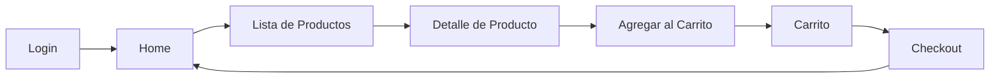
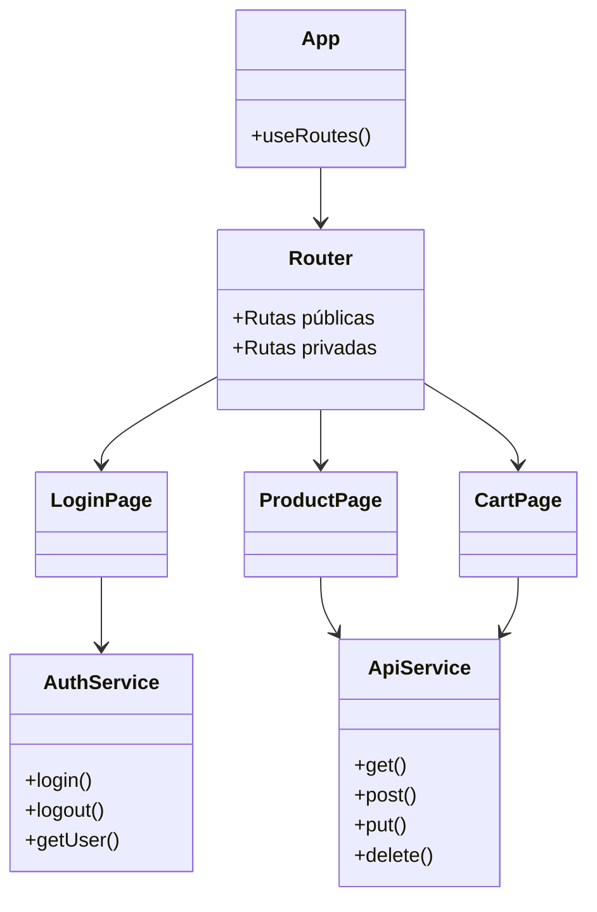

# 🛍️ MarketPau – Frontend

MarketPau es el frontend del sistema Marketplace construido en **React**, **Vite** y **React Router**, encargado de gestionar la experiencia visual del usuario, integración con el backend y flujo de compra (autenticación, navegación, productos, carrito, etc.).

Este proyecto se integra directamente con el backend desarrollado en **Spring Boot**, permitiendo un flujo completo cliente–servidor. Puede consultar el backend en el siguiente repositorio: https://github.com/sanntr/uninpahu

---

## 📚 Contenido

- [Descripción general](#descripción-general)
- [Tecnologías utilizadas](#tecnologías-utilizadas)
- [Arquitectura del proyecto](#arquitectura-del-proyecto)
- [Estructura de carpetas](#estructura-de-carpetas)
- [Scripts disponibles](#scripts-disponibles)
- [Instalación](#instalación)
- [Ejecución en desarrollo](#ejecución-en-desarrollo)
- [Build de producción](#build-de-producción)
- [Integración con backend](#integración-con-backend)
- [Variables de entorno](#variables-de-entorno-opcional)
- [Diagramas Mermaid](#diagramas-mermaid)

---

# 🧾 Descripción general

Este frontend implementa:

- Interfaz de usuario responsiva para el marketplace  
- Navegación con **React Router Dom**
- Consumo del backend mediante **Axios**
- Manejo de autenticación mediante **JWT Decode**
- Componentes dinámicos con **Swiper**
- Diseño modular y escalable con buenas prácticas

---

# 🛠️ Tecnologías utilizadas

### **Dependencias principales**
- **React 19**
- **React DOM 19**
- **React Router Dom 7.9**
- **Axios**
- **JWT Decode**
- **React Icons**
- **Swiper.js**

### **Dependencias de desarrollo**
- **Vite 7**
- **ESLint**
- **@vitejs/plugin-react-swc**
- Tipos de React (`@types/react`, `@types/react-dom`)

---

# 🧱 Arquitectura del proyecto

- El frontend sigue una arquitectura modular basada en:
- components/ → Componentes reutilizables
- pages/ → Vistas principales del sistema
- routes/ → Configuración de navegación
- services/ → Consumo de API (Axios)
- hooks/ → Lógica reutilizable
- context/ → Estados globales (opcional)
- assets/ → Imágenes, estilos, íconos


---

# 📁 Estructura de carpetas

*Esta estructura es standard, si desea modificarla solo clone el repositorio en su local*

```plaintext
MarketPau/
├── public/
├── src/
│   ├── assets/
│   ├── components/
│   ├── pages/
│   ├── routes/
│   ├── services/
│   ├── hooks/
│   ├── context/
│   ├── App.jsx
│   └── main.jsx
├── package.json
├── vite.config.js
└── README.md
```

---

# 🧪 Scripts disponibles

Tomados del `package.json`.

---

## ▶️ Ejecutar en desarrollo

```bash
npm run dev
```
## 🏗️ Generar build de producción

```bash
npm run build
```

Puede consultar otros comandos de npm + react + vite
---

## 🔗 Integración con backend

import axios from "axios";

const api = axios.create({
  baseURL: "http://localhost:8080/api",
});

export default api;

Puedes modificar la URL en un archivo como:

src/services/api.js

---

## Diagramas

🔷 Flujo general de navegación


🔶 Estructura lógica del frontend




